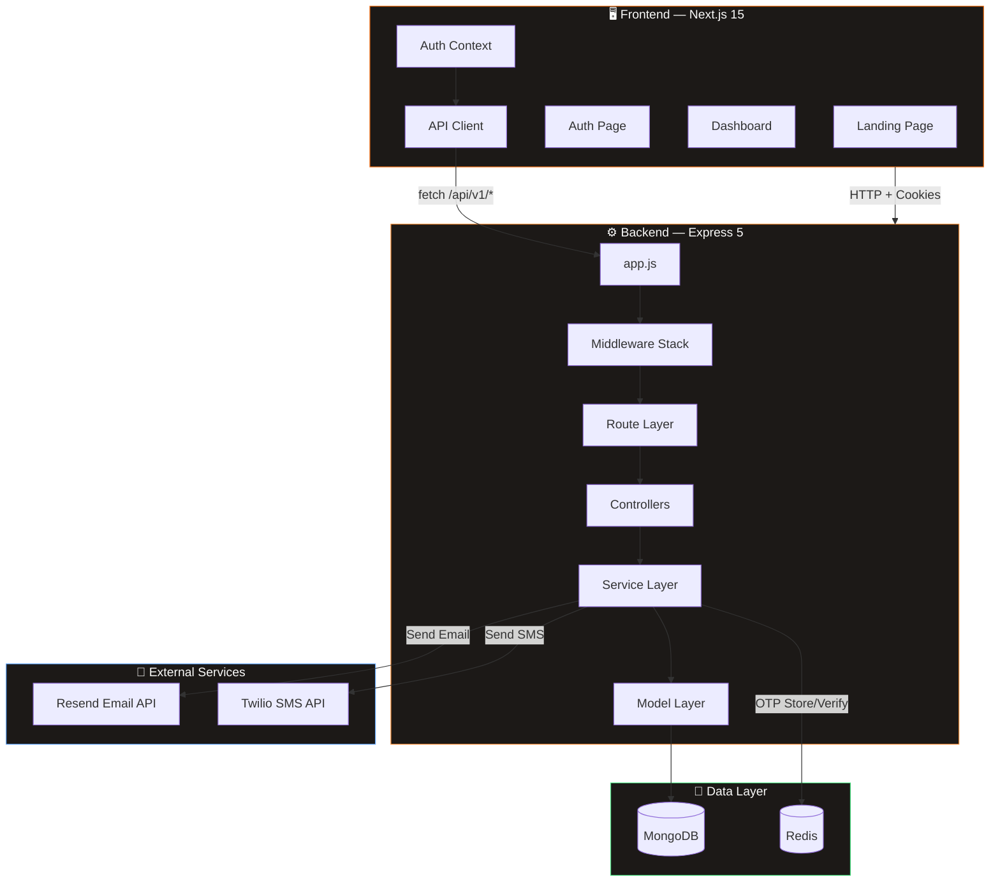
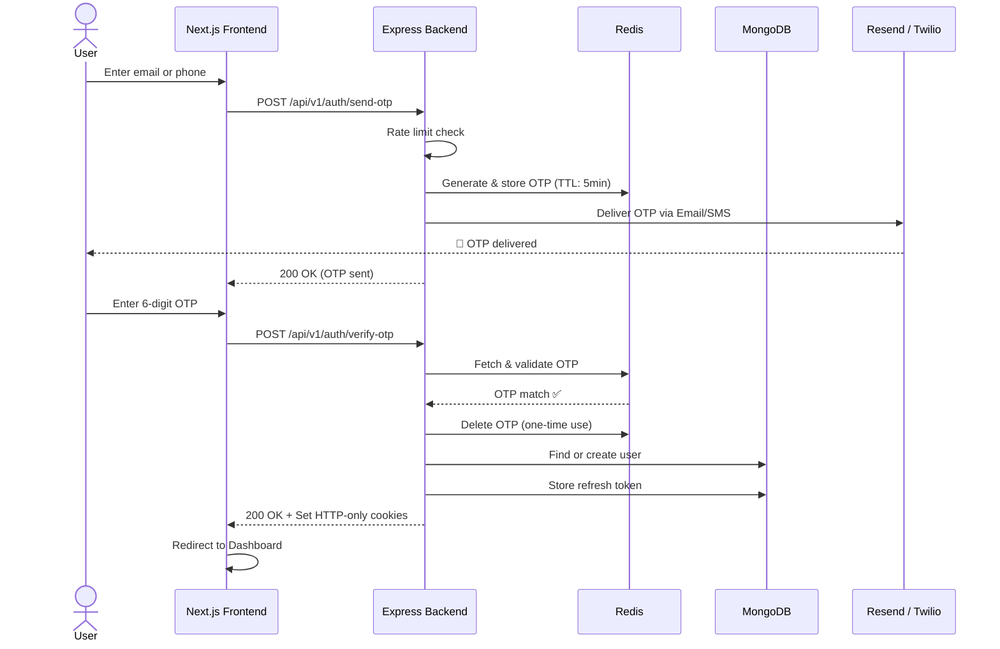
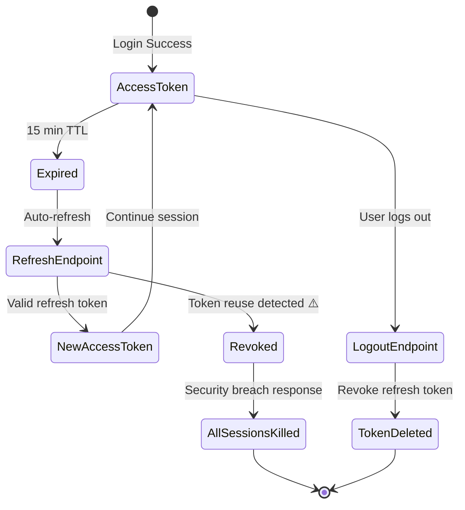
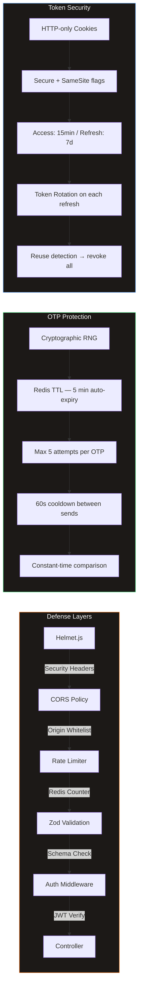
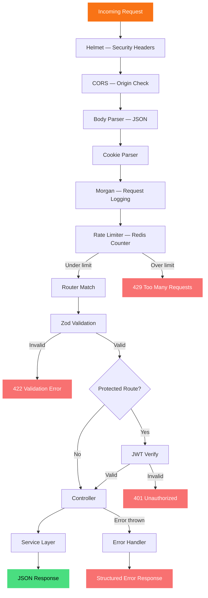
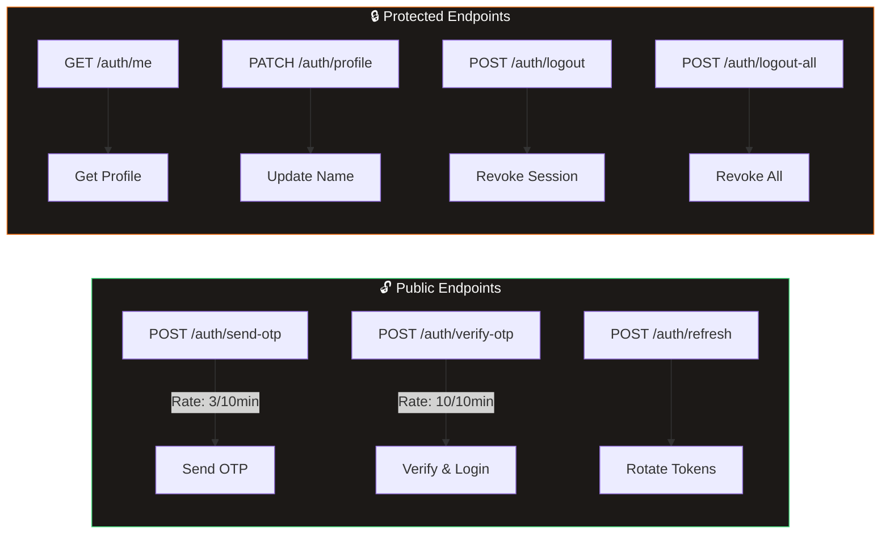
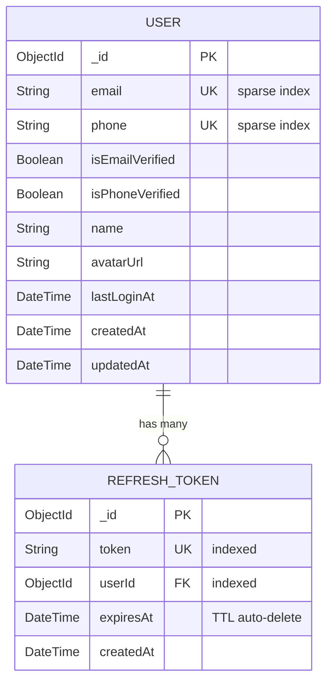

<p align="center">
  
  
  
  
  
  
  
</p>

<h1 align="center">🔐 OTP Auth System</h1>

<p align="center">
  <strong>Production-grade OTP Authentication with Email & Phone Verification</strong><br/>
  <em>Redis-powered OTP storage · JWT token rotation · Rate limiting · Glassmorphic UI</em>
</p>

---

## 🏗️ System Architecture



---

## 🔄 Authentication Flow



---

## 🔐 JWT Token Rotation & Security



---

## 📁 Project Structure

```
otp-auth/
│
├── backend/                          # Express 5 API Server
│   ├── server.js                     # Entry — boots MongoDB, Redis, HTTP
│   ├── app.js                        # Express config, middleware chain, routes
│   ├── .env                          # Environment variables
│   │
│   └── src/
│       ├── config/
│       │   ├── env.js                # Centralized env loader
│       │   ├── db.js                 # Mongoose connection
│       │   └── redis.js              # ioredis client + fallback
│       │
│       ├── models/
│       │   ├── user.model.js         # Mongoose User schema + statics
│       │   └── token.model.js        # RefreshToken schema + TTL index
│       │
│       ├── controllers/
│       │   └── auth.controller.js    # sendOtp, verifyOtp, refresh, logout, me
│       │
│       ├── services/
│       │   ├── otp.service.js        # Redis OTP: generate, store, verify
│       │   ├── email.service.js      # Resend integration + console fallback
│       │   ├── sms.service.js        # Twilio integration + console fallback
│       │   └── token.service.js      # JWT access/refresh + rotation
│       │
│       ├── middlewares/
│       │   ├── auth.middleware.js     # JWT cookie/bearer verification
│       │   ├── validate.middleware.js # Zod schema validation
│       │   ├── rateLimiter.middleware.js # Redis-based rate limiting
│       │   └── error.middleware.js    # Global error handler + 404
│       │
│       ├── validators/
│       │   └── auth.validator.js     # Zod schemas: sendOtp, verifyOtp, profile
│       │
│       └── routes/
│           ├── index.js              # API v1 router + health check
│           └── auth.routes.js        # Auth endpoints with middleware chains
│
└── frontend/                         # Next.js 15 (App Router)
    └── src/
        ├── app/
        │   ├── layout.js             # Root layout + AuthProvider
        │   ├── page.js               # Landing page
        │   ├── globals.css           # Design system (warm palette)
        │   ├── auth/page.js          # Login → OTP verification flow
        │   └── dashboard/page.js     # Protected dashboard
        │
        ├── components/
        │   ├── Button/               # Primary/Ghost variants
        │   ├── Input/                # Text input with icon
        │   ├── OtpInput/             # 6-digit smart OTP input
        │   └── PhoneInput/           # Country code picker + phone
        │
        ├── context/
        │   └── AuthContext.js        # Auth state + API methods
        │
        └── lib/
            ├── api.js                # Fetch wrapper with credentials
            └── countries.js          # Country dial codes + flags
```

---

## 🛡️ Security Architecture



---

## ⚡ Request Lifecycle



---

## 🚀 Quick Start

### Prerequisites

| Tool | Version | Purpose |
|------|---------|---------|
| Node.js | v20+ | Runtime |
| MongoDB | v6+ | User database |
| Redis | v7+ | OTP storage & rate limiting |

### 1. Clone & Install

```bash
git clone <repo-url> && cd otp-auth

# Backend
cd backend
npm install

# Frontend
cd ../frontend
npm install
```

### 2. Configure Environment

```bash
# backend/.env — Required
DATABASE_URL="mongodb://localhost:27017/otp_auth"
REDIS_URL="redis://localhost:6379"
JWT_ACCESS_SECRET="your-secret-here"
JWT_REFRESH_SECRET="your-secret-here"

# Optional (leave blank for console fallback)
RESEND_API_KEY=""
TWILIO_ACCOUNT_SID=""
TWILIO_AUTH_TOKEN=""
TWILIO_PHONE_NUMBER=""
```

### 3. Run

```bash
# Terminal 1 — Backend
cd backend && npm run dev

# Terminal 2 — Frontend
cd frontend && npm run dev
```

| Service | URL |
|---------|-----|
| Frontend | http://localhost:3000 |
| Backend API | http://localhost:5000/api/v1 |
| Health Check | http://localhost:5000/api/v1/health |

---

## 📡 API Reference



### Send OTP
```http
POST /api/v1/auth/send-otp
Content-Type: application/json

{
  "type": "email",           // "email" | "phone"
  "identifier": "you@example.com"  // or "+919876543210"
}
```

### Verify OTP
```http
POST /api/v1/auth/verify-otp
Content-Type: application/json

{
  "type": "email",
  "identifier": "you@example.com",
  "otp": "847293"
}
```

---

## 🧩 Database Schema




<p align="center">
  <sub>Built with ❤️ and lots of ☕</sub>
</p>
